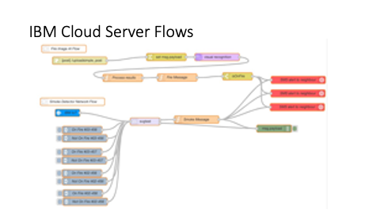

# LitmusProtector
A network of devices to galvanise a new wave of Community First Responders (CFR).
Presented by Team LitFam (Lum Wei Boon, Sean Chan, Yap Zuo Ming, Sing Hui, Peh Zhi Qian Justin)

## Introduction
Residential fires made up more than 40% of all fire calls made to the SCDF in 2019. Many of those are unattended cooking, and can be put out by community first responders if detected early. Our device seeks to address this issue, and also foster a sense of community spirit when neighbours help one another out.

The Litmus Protector is a smart smoke detector with a camera and connection to the internet. When the smoke alarm is activated, the feed from the camera will be streamed to the residents' mobile devices. The user can send a distress signal instantly to neighbours in the same block for help. A system override will also occur after a set duration that will send a distress signal to neighbours.

## Pitch Video

## Architecture and Details

Figure 1

Litmus Protector consists two main parts. The first is the actual Litmus Protector device, which is a smart home fire and smoke detector using a PiCamera and a Xiaomi Mijia Honeywell Smoke Detector based on a Raspberry Pi. The second part would be the IoT network hosted on IBM Cloud, which monitors individual Litmus Protector devices and sends distress signals to the neighbours' phones.

Figure 2

Figure 3

Figure 2 and 3 shows

## Getting started
1. Import [network-flows.json](./network-flows.json) into a Node-RED application on IBM Cloud.
2. Sign up for [Twilio API's](https://www.twilio.com) SMS service to generate a new number to send messages from.
3. After connecting up a Raspberry Pi connected wirelessly to a IoT Smoke Sensor to an instance of the IBM Watson IoT Platform, import [device-flows.json](./device-flows.json) on a Node-RED application on the Pi.

## Demo
Visit our Node-RED [website](https://detector-network.mybluemix.net/svgtest/) to take a look at an example of the dashboard of the application showing
households on fire or not. 

## Hardware Required

* Raspberry Pi (with Raspbian installed)
* Xiaomi Smoke Detector
* Xiaomi Smart home hub
* USB Webcam / PiCamera

## Software used to build LitmusProtector

* IBM Cloudant - Deploy the Node-RED applications
* IBM Cloud Node-RED- Organise the flows of both the network and the sensor data sent by the devices
* IBM Watson IoT Platform - To handle sensor data from multiple devices
* IBM Cloud Visual Recognition Service - To process images sent by the device and detect for fire